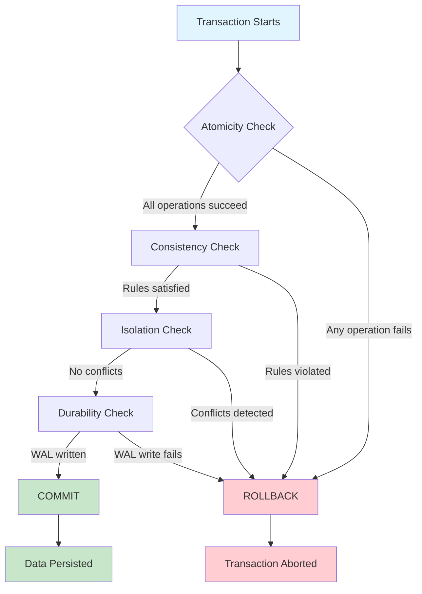
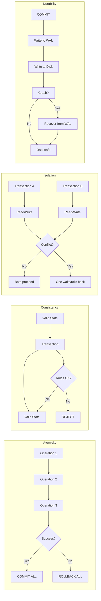
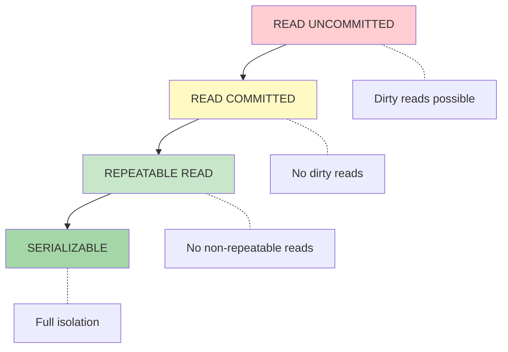
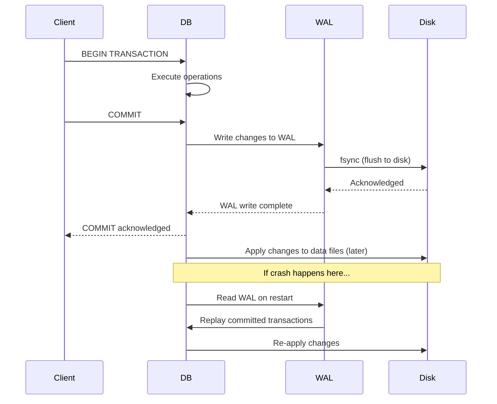
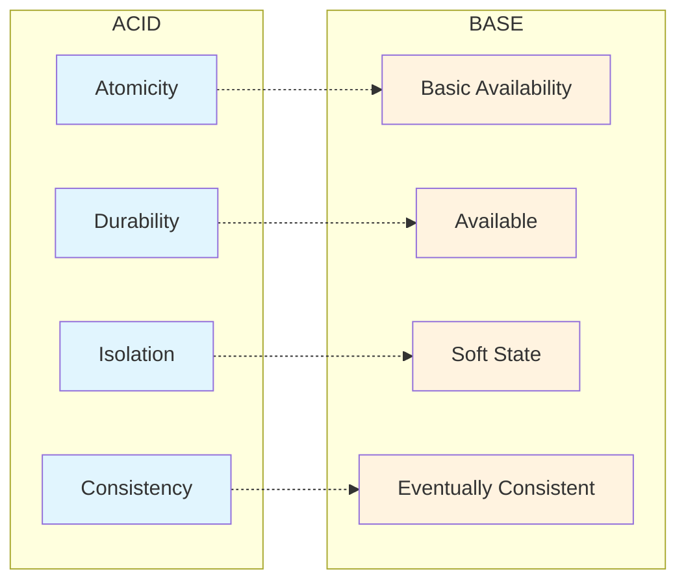
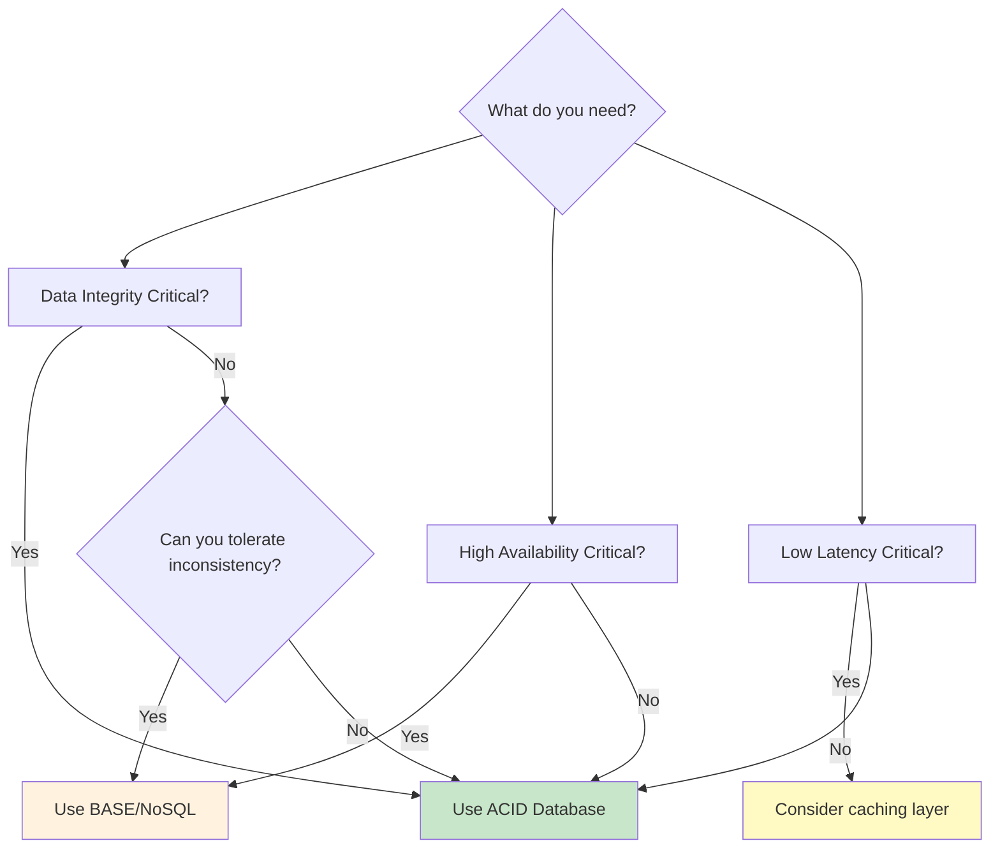

# ACID Properties — Visual Diagram

A Mermaid diagram showing how the four ACID properties work together.

---

## Transaction Lifecycle

---

## How Each Property Works

---

## Isolation Levels Hierarchy

---

## WAL (Write-Ahead Log) Flow

---

## ACID vs. BASE Comparison

---

## When to Use Each

